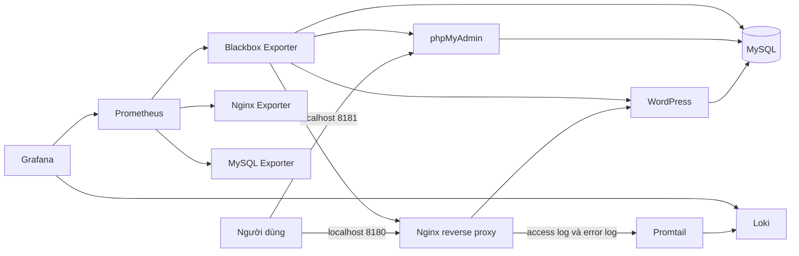

# Đề 3 Website Quảng bá Sản phẩm bằng WordPress

## 1 Giới thiệu

Project triển khai website giới thiệu và quảng bá sản phẩm bằng WordPress, lưu dữ liệu trong MySQL và quản trị cơ sở dữ liệu qua phpMyAdmin. Toàn bộ ứng dụng, reverse proxy, hệ thống giám sát và hệ thống log tập trung chạy bằng Docker Compose với tên project `de3-wordpress-product`.

Plugin `DE3 Product Showcase` đăng ký loại nội dung Sản phẩm trong WordPress và khởi tạo sáu sản phẩm mẫu. Tên, mô tả, mã sản phẩm, giá và đường dẫn hình ảnh được lưu qua WordPress/MySQL, vì vậy đây là website động có chức năng quản lý nội dung.

## 2 Kiến trúc hệ thống



Ba mạng Compose tách biệt lưu lượng:

- `frontend`: Nginx, WordPress, phpMyAdmin và các phép kiểm tra HTTP cần thiết.
- `backend`: WordPress, phpMyAdmin, MySQL và MySQL Exporter. Mạng này đặt `internal: true`.
- `monitoring`: Prometheus, Grafana, Loki, Promtail và các exporter.

## 3 Các thành phần

| Thành phần | Vai trò | Truy cập từ máy chủ |
|---|---|---|
| WordPress | Website và quản lý nội dung sản phẩm | Chỉ qua Nginx |
| MySQL | Lưu dữ liệu WordPress | Không public cổng 3306 |
| phpMyAdmin | Quản trị cơ sở dữ liệu | `http://localhost:8181` |
| Nginx | Reverse proxy và security headers | `http://localhost:8180` |
| Prometheus | Thu thập metrics | `http://localhost:9091` |
| Grafana | Dashboard metrics và truy vấn log | `http://localhost:3001` |
| Loki | Lưu và truy vấn log tập trung | `http://localhost:3101` |
| Promtail | Đọc log Nginx và gửi tới Loki | Không public cổng |
| Nginx Exporter | Metrics web server | Không public cổng |
| MySQL Exporter | Metrics database | Không public cổng |
| Blackbox Exporter | Theo dõi khả năng truy cập của container | Không public cổng |

## 4 Cấu trúc project

```text
de3-wordpress-product/
├── docker-compose.yml
├── .env.example
├── scripts/
│   └── bootstrap.ps1
├── wordpress/de3-product-showcase/
├── mysql/init/
├── nginx/
├── prometheus/
├── grafana/
│   ├── dashboards/
│   └── provisioning/
├── loki/
├── promtail/
├── secrets/                 # Chỉ giữ .gitkeep trên Git
└── docs/
    ├── screenshots/
    └── report/
```

## 5 Yêu cầu môi trường

- Windows 10 hoặc Windows 11.
- Docker Desktop đang chạy Linux containers.
- Docker Compose v2.
- PowerShell 7 hoặc Windows PowerShell 5.1.
- Tối thiểu khoảng 4 GB RAM trống cho toàn bộ stack.

Project không dùng VMware và không cần Ubuntu VM.

## 6 Chuẩn bị cấu hình và secret

Chạy lệnh sau tại thư mục project:

```powershell
.\scripts\bootstrap.ps1
```

Script tạo `.env` từ `.env.example` và sinh mật khẩu mạnh ngẫu nhiên trong thư mục `secrets`. `.env` và toàn bộ secret thật đã được `.gitignore`, không được commit lên GitHub.

Trước khi nộp bài, cập nhật `WP_ADMIN_EMAIL` trong `.env` thành email phù hợp. Tên đăng nhập WordPress nằm trong `.env`; mật khẩu quản trị chỉ nằm trong tệp cục bộ `secrets/wp_admin_password`.

## 7 Cách chạy Docker Compose

```powershell
docker compose up -d
docker compose ps -a
```

Nếu lệnh `docker compose` không hoạt động, dùng executable Docker Compose của Docker Desktop:

```powershell
& 'C:\Users\vietdo1201\AppData\Local\Programs\DockerDesktop\resources\bin\docker-compose.exe' up -d
```

Container `wordpress-init` chạy một lần rồi kết thúc với mã 0. Đây là trạng thái đúng: service này cài WordPress, kích hoạt plugin sản phẩm, cấu hình permalink và URL website.

## 8 Website WordPress

Mở `http://localhost:8180`. Nginx chuyển request tới WordPress; WordPress không public cổng riêng ra máy chủ.

Website có:

- Trang chủ giới thiệu danh mục sản phẩm.
- Trang danh sách nhiều sản phẩm.
- Sáu sản phẩm có tên, mã, mô tả, giá và hình ảnh.
- Trang chi tiết từng sản phẩm.
- Khu vực quản trị WordPress tại `http://localhost:8180/wp-admin/`.
- Loại nội dung Sản phẩm để thêm, sửa và xóa nội dung qua WordPress Admin.

## 9 MySQL và phpMyAdmin

MySQL dùng database `wordpress` và tài khoản ứng dụng có quyền giới hạn cho database này. Cổng 3306 chỉ được expose trong mạng Compose, không ánh xạ ra máy chủ.

Mở `http://localhost:8181` để đăng nhập phpMyAdmin. Dùng tài khoản ứng dụng `wordpress`; mật khẩu nằm trong secret cục bộ `secrets/mysql_wordpress_password`. Có thể kiểm tra dữ liệu sản phẩm trong bảng `wp_posts` và metadata trong `wp_postmeta`.

## 10 Nginx reverse proxy

Cấu hình nằm tại `nginx/default.conf`. Website chỉ được truy cập từ máy chủ qua Nginx ở cổng 8180. Nginx chuyển tiếp các header `Host`, `X-Real-IP`, `X-Forwarded-For`, `X-Forwarded-Proto` và giới hạn upload ở 32 MB.

Các security header được trả trên mọi phản hồi:

- `X-Frame-Options: SAMEORIGIN`
- `X-Content-Type-Options: nosniff`
- `Referrer-Policy: strict-origin-when-cross-origin`
- `Permissions-Policy: camera=(), microphone=(), geolocation=()`
- `Content-Security-Policy: frame-ancestors 'self'; object-src 'none'; base-uri 'self'`

## 11 Prometheus

Mở `http://localhost:9091/targets`. Các job cần ở trạng thái UP:

- `prometheus`
- `nginx`
- `mysql`
- `container-http`
- `container-tcp`

Blackbox Exporter kiểm tra khả năng truy cập trực tiếp của Nginx, WordPress, phpMyAdmin và MySQL qua mạng Compose mà không cần quyền truy cập Docker daemon.

## 12 Grafana

Mở `http://localhost:3001`. Tên đăng nhập mặc định là `admin`; mật khẩu nằm trong secret cục bộ `secrets/grafana_admin_password`.

Thư mục dashboard `DE3 WordPress` được provision tự động với:

1. `DE3 Container Monitoring`: số container truy cập được và lịch sử `probe_success`.
2. `DE3 Nginx Monitoring`: trạng thái Nginx, kết nối đang hoạt động và tốc độ request.
3. `DE3 MySQL Monitoring`: trạng thái MySQL, số kết nối, dung lượng database và tốc độ query.
4. `DE3 Nginx Logs`: log Nginx lấy từ Loki.

## 13 Loki và Promtail

Promtail đọc `/var/log/nginx/access.log` và `/var/log/nginx/error.log` từ volume chỉ đọc. Pipeline tách nhãn `method` và `status`, sau đó gửi log tới Loki. Loki lưu dữ liệu trong volume riêng với thời gian retention 7 ngày.

Grafana đã provision datasource `Loki` trỏ tới `http://loki:3100`. Có thể kiểm tra trạng thái Loki tại `http://localhost:3101/ready`.

## 14 LogQL

Trong Grafana, chọn Explore, chọn datasource Loki và chạy ba truy vấn:

```logql
{job="nginx"}
```

```logql
{job="nginx"} |= "GET"
```

```logql
{job="nginx"} |~ "404"
```

Để chứng minh phản hồi 404 thực, có thể truy vấn thêm:

```logql
{job="nginx", status="404"}
```

## 15 Hardening

Project áp dụng các biện pháp sau:

1. MySQL không public cổng 3306; chỉ các service trong mạng backend truy cập được.
2. Mạng backend đặt `internal: true` và tách khỏi mạng frontend, monitoring.
3. Mật khẩu được sinh ngẫu nhiên, lưu trong Docker secrets cục bộ và không commit.
4. Nginx trả năm security header trên mọi phản hồi.
5. Nginx, Prometheus, Loki, Promtail và các exporter dùng filesystem chỉ đọc khi phù hợp.
6. Các service phù hợp bỏ Linux capabilities bằng `cap_drop: ALL` và bật `no-new-privileges`.
7. Grafana tắt tự đăng ký tài khoản và truy cập anonymous.
8. WordPress tắt trình sửa file plugin/theme trong Admin bằng `DISALLOW_FILE_EDIT`.
9. Tài khoản MySQL exporter chỉ có các quyền `PROCESS`, `REPLICATION CLIENT` và `SELECT` phục vụ giám sát.

## 16 Cách dừng hệ thống

```powershell
docker compose down
```

Lệnh trên chỉ dừng và xóa container/network thuộc project `de3-wordpress-product`, giữ nguyên các volume dữ liệu. Không dùng các lệnh prune.

Khi cần xóa dữ liệu để cài lại từ đầu, chỉ thực hiện sau khi đã sao lưu và xác nhận đúng project:

```powershell
docker compose down --volumes
```

## 17 Các URL demo

| Nội dung | URL |
|---|---|
| Website | `http://localhost:8180` |
| WordPress Admin | `http://localhost:8180/wp-admin/` |
| phpMyAdmin | `http://localhost:8181` |
| Prometheus | `http://localhost:9091` |
| Prometheus Targets | `http://localhost:9091/targets` |
| Grafana | `http://localhost:3001` |
| Loki Ready | `http://localhost:3101/ready` |

## Lưu ý trước khi nộp

- Tài khoản GitHub của sinh viên phải đặt tên theo mã số sinh viên.
- Kiểm tra repository đã có đủ source, cấu hình, README và đúng ba commit có ý nghĩa.
- Không push secret, `.env`, mật khẩu hoặc ảnh chứa mật khẩu.
- Chỉ push khi người thực hiện đã kiểm tra remote repository và cho phép.

